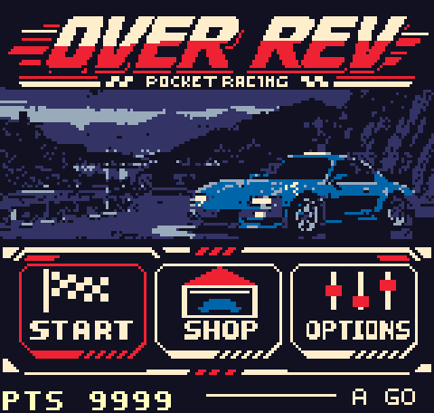

# OVER REV

An arcade racing homebrew for the **Neo Geo Pocket Color**.

Pick your ride, upgrade it, and take on your rivals across a varied selection of tracks. OVER REV combines quick races with story campaigns, a touch of humour, and a few surprises to discover along the way.

## A few highlights

- **16 tracks** and **three story campaigns**.
- A garage of vehicles to unlock and upgrade.
- **Automatic or manual transmission**.
- **Time Attack**, saved records, and best-time ghosts.
- **Two-player racing** via link cable on compatible hardware.
- **Six languages:** English, French, German, Spanish, Portuguese, and Japanese. (Native-speaking translators and proofreaders for the languages ​​offered are welcome.)

## Play

| Download | How to play |
|---|---|
| [Windows standalone version](overrev.exe) | Download and run `overrev.exe`. The game is packaged with its emulator, so no separate emulator installation is needed. |
| [Neo Geo Pocket Color ROM](overrev.ngc) | Load `overrev.ngc` in a compatible emulator, or play on a Neo Geo Pocket Color using a compatible flash cartridge. |

This repository contains the playable builds and a gameplay preview.
